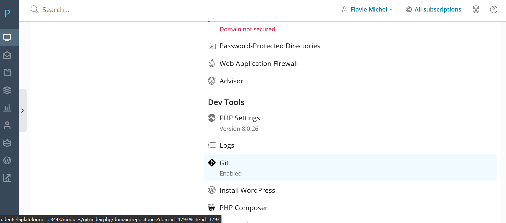
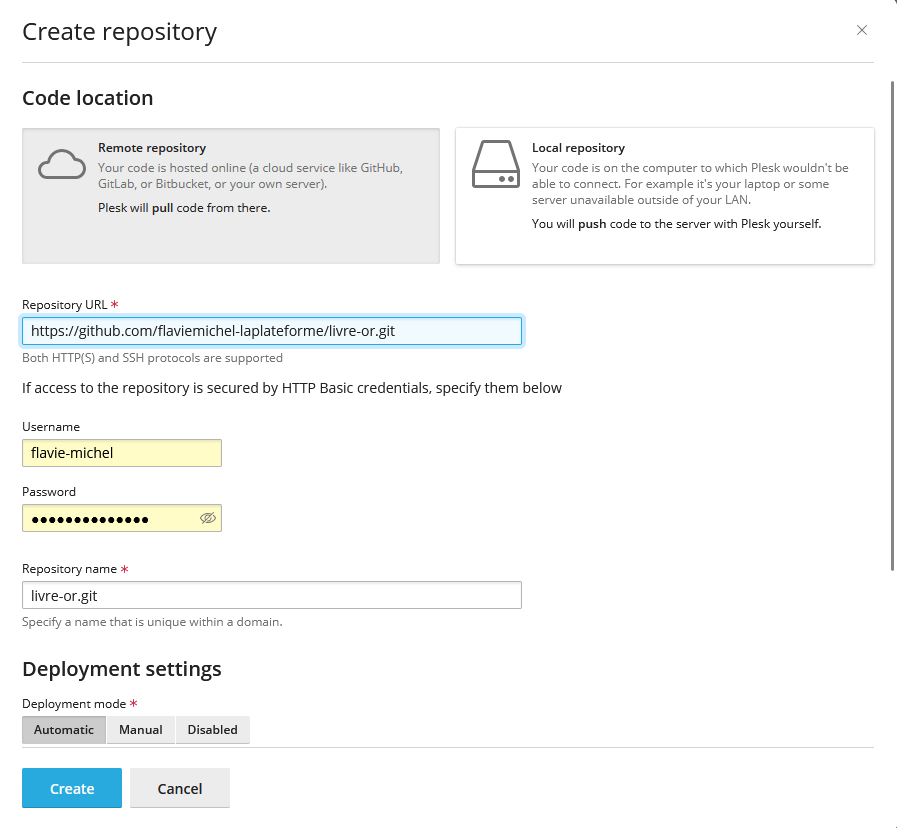
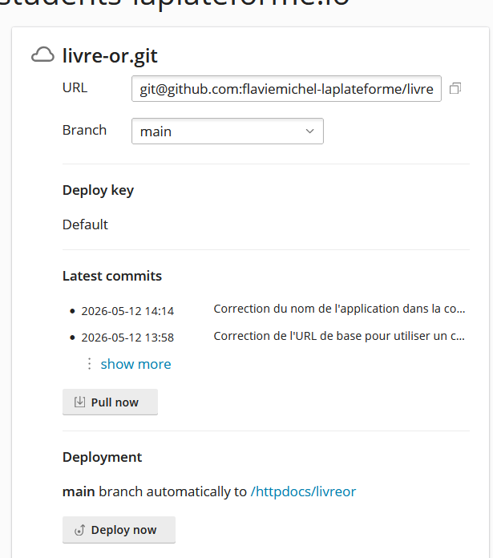
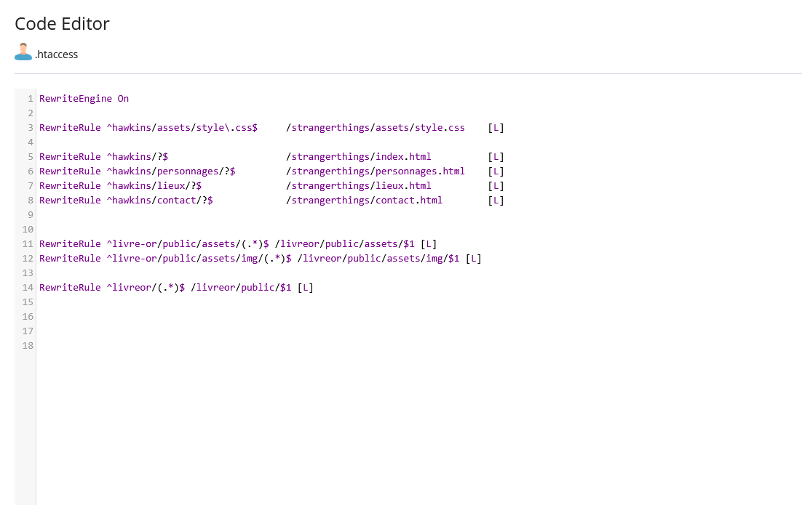
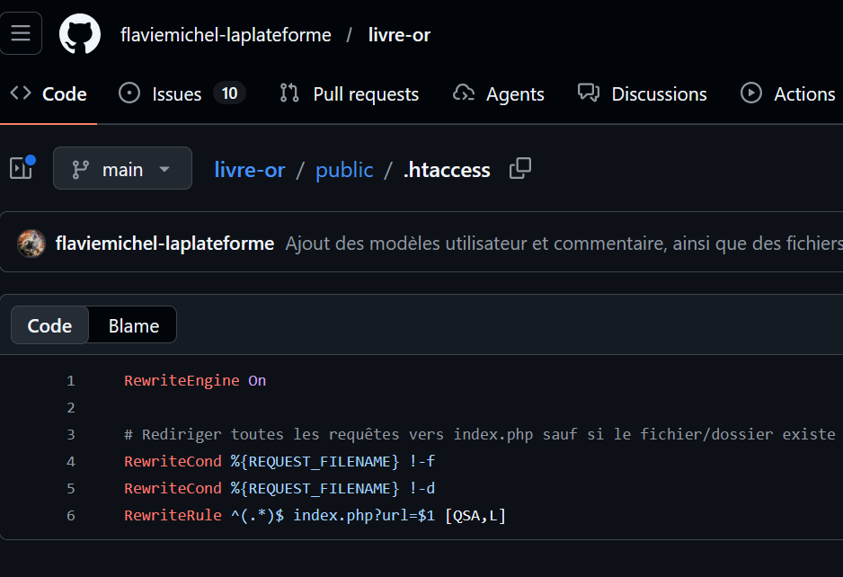
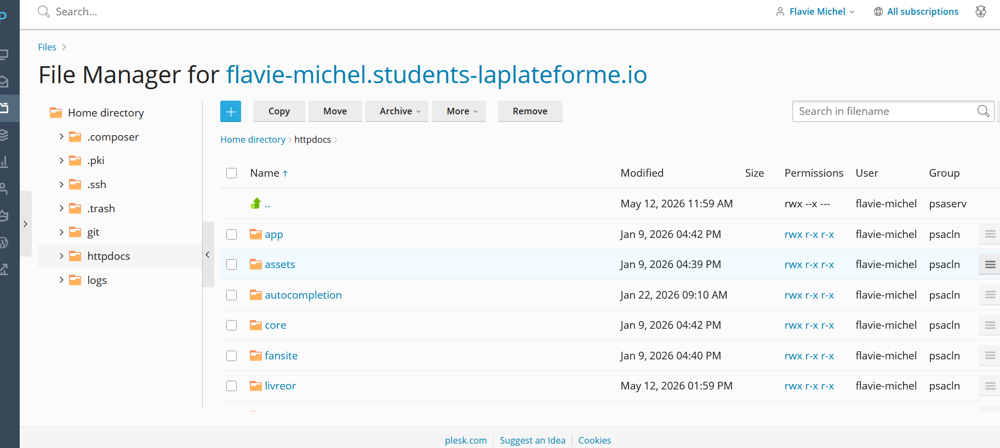
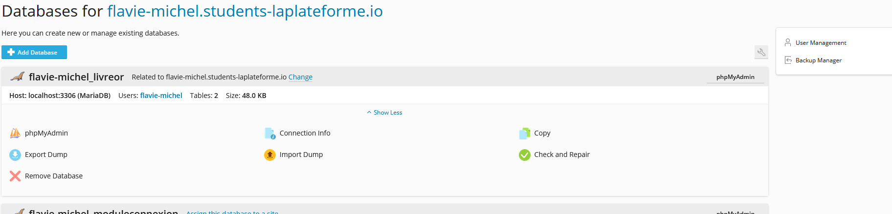
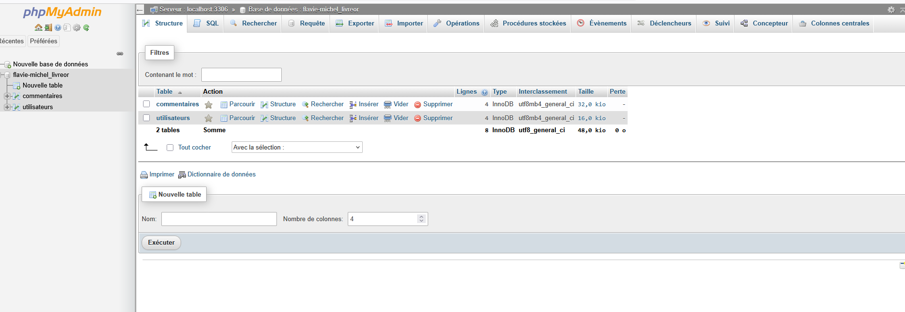
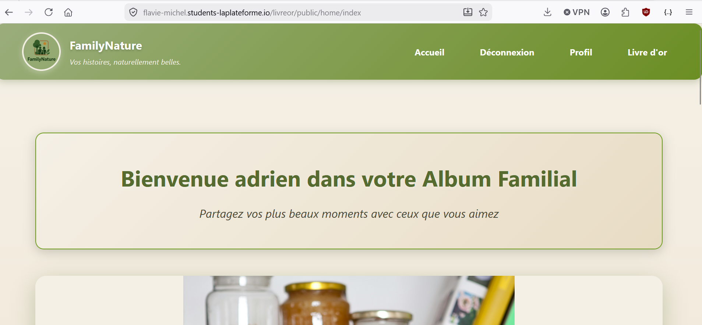

# 📖 Livre d'Or - Documentation Technique & Déploiement

Application PHP MVC permettant la création et la gestion d'un livre d'or en ligne.

## 📋 Présentation du Projet

Livre d'Or est une application web dynamique développée en PHP natif selon une architecture MVC (Modèle-Vue-Contrôleur). Ce projet a été conçu pour offrir une plateforme sécurisée de partage de commentaires entre utilisateurs authentifiés.
Fonctionnalités Clés

- Système d'Authentification : Inscription, connexion sécurisée et gestion de session.

- Gestion des Profils : Espace utilisateur pour la modification des informations personnelles.

- Livre d'Or Interactif : Consultation publique et publication de commentaires pour les membres connectés.

- Sécurité : Hachage des mots de passe (bcrypt) et protection contre les injections SQL (PDO).

## 🏗️ Architecture du Projet (MVC Maison)

L'application repose sur une séparation stricte des responsabilités pour garantir la maintenabilité :
Plaintext

```text
livre-or/
├── config/              # Configuration de l'application
│   └── database.php     # Connexion à la base de données
├── controllers/         # Contrôleurs (logique métier)
├── core/                # Routage, base de données, vues
├── includes/            # Fonctions utilitaires
├── models/              # Modèles (accès aux données)
├── public/              # Point d'entrée web
│   ├── index.php
│   └── .htaccess
├── views/               # Vues HTML
└── livreor.sql          # Structure de la base de données
```

## Fonctionnement MVC

- [config/database.php](config/database.php) centralise les paramètres de connexion et la base d'URL.
- [public/index.php](public/index.php) est le point d'entrée unique de l'application.
- [core/router.php](core/router.php) lit l'URL et appelle le bon contrôleur.
- Les contrôleurs orchestrent la logique.
- Les modèles gèrent les requêtes SQL.
- Les vues affichent les pages.

## 🛠️ Installation Locale (Développement)

## Prérequis

- PHP 8.1 ou supérieur,
- MySQL 8.0 ou supérieur,
- Laragon, XAMPP ou un environnement équivalent.

Étapes d'installation

    Cloner le projet : git clone https://github.com/votre-compte/livre-or.git

    Importer la base de données située à la racine.

    Configurer les accès dans config/database.php.

    Pointer votre serveur web sur le dossier /public.

Exemple d'accès local :

```text
http://localhost/livre-or/public
```

## Base de données

### Tables principales

#### `utilisateurs`

| Colonne  | Type         | Description                   |
| -------- | ------------ | ----------------------------- |
| id       | INT          | Clé primaire auto-incrémentée |
| login    | VARCHAR(255) | Nom d'utilisateur unique      |
| password | VARCHAR(255) | Mot de passe hashé            |

#### `commentaires`

| Colonne        | Type     | Description                   |
| -------------- | -------- | ----------------------------- |
| id             | INT      | Clé primaire auto-incrémentée |
| commentaire    | TEXT     | Contenu du commentaire        |
| id_utilisateur | INT      | Référence vers l'utilisateur  |
| date           | DATETIME | Date et heure du commentaire  |

## Procédure de déploiement professionnel sur Plesk

Cette partie présente le passage du projet en ligne sur un hébergement Plesk. L'objectif était de reproduire un déploiement simple mais réaliste : dépôt Git connecté au serveur, application servie depuis le bon dossier, et base de données importée sur l'environnement de production.

### 1. Création et connexion du dépôt Git

Le projet a d'abord été déclaré dans Plesk comme dépôt distant. L'URL du dépôt GitHub a été renseignée, puis la branche main a été choisie comme source de déploiement.

La capture ci-dessous montre l'interface Git de Plesk et confirme que le dépôt est bien pris en charge par le serveur.



La création du dépôt dans Plesk a ensuite été effectuée via le formulaire dédié, avec la cible de déploiement vers le répertoire du site.



Après la mise en place, un pull a permis de récupérer les fichiers du projet sur l'hébergement.



### 2. Configuration de la réécriture d'URL

Mon application suit une architecture MVC. Pour que les routes fonctionnent correctement, le fichier .htaccess redirige les requêtes vers le point d'entrée de l'application, tout en gardant l'accès aux ressources statiques comme les images et les feuilles de style.

Cette étape est importante car elle évite l'accès direct aux dossiers sensibles comme config, core, models ou controllers.



La capture suivante montre également la version du fichier .htaccess utilisée dans le dépôt GitHub.



### 3. Mise en place de l'arborescence sur le serveur

Une fois le dépôt synchronisé, j'ai vérifié la présence du projet dans le dossier cible du serveur, ici le répertoire httpdocs. Cette vérification permet de confirmer que les fichiers sont bien copiés au bon emplacement.



### 4. Création et import de la base de données

La base de données a été créée depuis l'interface Plesk, puis le script SQL du projet a été importé via phpMyAdmin. Enfin, le fichier de configuration de l'application a été mis à jour avec les informations de connexion de l'environnement de production.





### 5. Vérification du site en ligne

Une fois le déploiement terminé, j'ai contrôlé le bon affichage de la page d'accueil et la cohérence générale de l'interface.



### Bilan du déploiement

Le site est maintenant accessible en ligne via Plesk. Cette mise en production m'a permis de valider plusieurs compétences attendues dans le cadre du titre DWWM : gestion d'un hébergement, déploiement via Git, configuration d'un environnement PHP, import de base de données et sécurisation d'une application MVC.

## 📝 Auteur

Michel Flavie – Développeuse Web & Web Mobile
